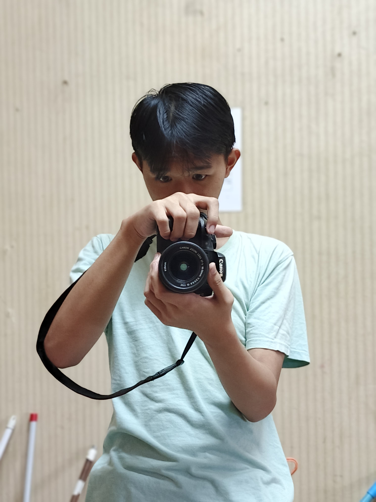

# 🌟 Welcome to Axcel's GitHub! 🌟

  

## 🚀 About Me  
👋 Hi! I'm **Axcel Rezezi**, a passionate **Backend Developer** & **Game Developer** who loves to code and create amazing digital experiences.

🎓 **Student at:** SMKN 21 Jakarta  
💻 **Tech Stack:** JavaScript, TypeScript, Laravel, React, Vue.js  
🎮 **Hobbies:** Coding | Gaming | Basketball  
📫 **Reach Me At:** [axcelrezezi@example.com](mailto:axcelrezezi@example.com) | [Instagram](https://instagram.com/rezezi_axcel)  

---

## 🛠️ Tech Stack  
### **Languages & Frameworks:**
- **Frontend:** React.js, Vue.js, Tailwind CSS  
- **Backend:** Laravel, Node.js, Express.js  
- **Databases:** MongoDB, MySQL  
- **Tools:** Docker, Git, Unity  

---

## 📈 GitHub Stats  

  
  
  

  

---

## 🌟 Featured Projects  
### 🎮 **Game Development**  
- **[Adventure Quest](https://github.com/rezezi/adventure-quest)** – A Unity-based adventure game with immersive gameplay and stunning visuals.  

### 🛠️ **Backend Development**  
- **[Zezi API](https://github.com/rezezi/zezi-api)** – Scalable API service built with Laravel and JWT authentication.  

> 🚀 Explore more in the [Repositories](https://github.com/rezezi?tab=repositories) tab!  

---

## 🌐 Connect With Me  

  
  
  

---

## 🏆 Certifications  
✔️ **React for Beginners** – Mastered the fundamentals of React.  
✔️ **Laravel Essentials** – Built scalable web applications with Laravel.  
✔️ **Docker Mastery** – Learned containerization and deployment.  

---

## 🎯 Fun Facts  
- 🎮 I love playing and developing games.  
- 🏀 I play basketball on weekends.  
- 🌟 My dream is to create an educational game that makes learning fun!  

---

  🚀 **"Code, Create, and Conquer!"** 🚀

